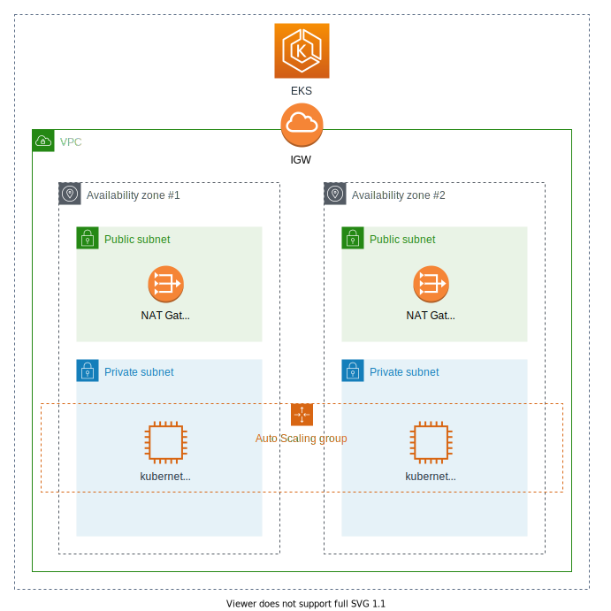

# Simple EKS Cluster

本用例将会利用现有的“牌”（组件）来部署EKS集群



## 预装软件

- [docker](https://docs.docker.com/desktop/#download-and-install)
- [cdk](https://github.com/aws/aws-cdk)
- [aws cli v2](https://docs.aws.amazon.com/cli/latest/userguide/install-cliv2.html)
- [setup aws configuration and credential file](https://docs.aws.amazon.com/cli/latest/userguide/cli-configure-files.html)
- [mctl](https://github.com/awslabs/aws-solutions-assembler/releases)

## 步骤

1. 确保aws cli工具配置正确，你可以通过以下命令检查

    ```shell
    $ aws configure list
        Name                    Value             Type    Location
        ----                    -----             ----    --------
    profile                <not set>             None    None
    access_key     ****************XAWA shared-credentials-file
    secret_key     ****************qEK5 shared-credentials-file
        region                us-east-2      config-file    ~/.aws/config
    ```

2. 启动Dice后台程序如果你是第一次使用的话:

    ```shell
    $ docker run -d -v ~/.aws:/root/.aws -p 9090:9090 docker.pkg.github.com/awslabs/aws-solutions-assembler/dice:latest
    ```

3. 创建一个YAML配置文件并将其命名为`simple-eks.yaml`

    ```yaml
    apiVersion: mahjong.io/v1alpha1
    kind: Deployment
    metadata:
    name: simple-eks
    version: 0.1.0
    spec:
    template:
        tiles:
        tileEks0005:
            tileReference: Eks0
            tileVersion: 0.0.5
            inputs:
            - name: clusterName
                inputValue: mahjong-cluster101
            - name: capacity
                inputValue: 3
            - name: capacityInstance
                inputValue: m5.large
            - name: version
                inputValue: 1.16
    summary:
        description:
        outputs:
        - name: EKS Cluster Name
            value: $(tileEks0005.outputs.clusterName)
        - name: Master role arn for EKS Cluster
            value: $(tileEks0005.outputs.masterRoleARN)
        - name: The API endpoint EKS Cluster
            value: $(tileEks0005.outputs.clusterEndpoint)
        - name: Instance type of worker node
            value: $(tileEks0005.outputs.capacityInstance)
        - name: Default capacity of worker node
            value: $(tileEks0005.outputs.capacity)

        notes: []
    ```

4. 执行CDK引导程序`cdk bootstrap aws://<your aws account>/<aws region>`，例如：

    ```
    cdk bootstrap aws://638198787577/us-east-2
    ```

    > :warning: 该步骤只需要执行一次，以后无需再执行

5. 部署到AWS`mctl deploy -f ./simple-eks.yaml`。如果一切顺利你讲会的得到一下结果:

    ```shell
    $ mctl deploy -f ./simple-eks.yaml

    ...

    [ℹ]  EKS Cluster Name = mahjong-cluster101
    [ℹ]  Master role arn for EKS Cluster = arn:aws:iam::638198787577:role/Eks0StacktileEks0005-Eks0EksClusterMasterRole76926-D9OV6NASDYGC
    [ℹ]  The API endpoint EKS Cluster = https://8F4AEE06CDA95AA5B9B82016B406F53B.gr7.us-east-2.eks.amazonaws.com
    [ℹ]  Instance type of worker node = m5.large
    [ℹ]  Default capacity of worker node = 3
    ```

6. 一旦完成以上步骤后便可以检查您部署好的集群`mahjong-cluster101`
    1. 从部署日志中找到EKS集群的Master role

        例如：

        ```
        arn:aws:iam::638198787577:role/Eks0StacktileEks0005-Eks0EksClusterMasterRole76926-D9OV6NASDYGC
        ```

    2. 用以下命令创建保存k8s的登陆配置`aws --region <region-code> eks update-kubeconfig --name <cluster_name> --role-arn arn:aws:iam::<aws_account_id>:role/<role_name>`.

        例如：

        ```
        aws --region us-east-2 eks update-kubeconfig--name mahjong-cluster101 --role-arn arn:aws:iam::638198787577:role/Eks0StacktileEks0005-Eks0EksClusterMasterRole76926-D9OV6NASDYGC
        ```

    3. 检查您的集群

        ```shell
        $ kubectl get svc
        NAME         TYPE        CLUSTER-IP   EXTERNAL-IP   PORT(S)   AGE
        kubernetes   ClusterIP   172.20.0.1   <none>        443/TCP   4h41m
        ```

        > :warning: 请确保您正确安装了[kubernetes-cli](https://kubernetes.io//docs/tasks/tools/install-kubectl/)
