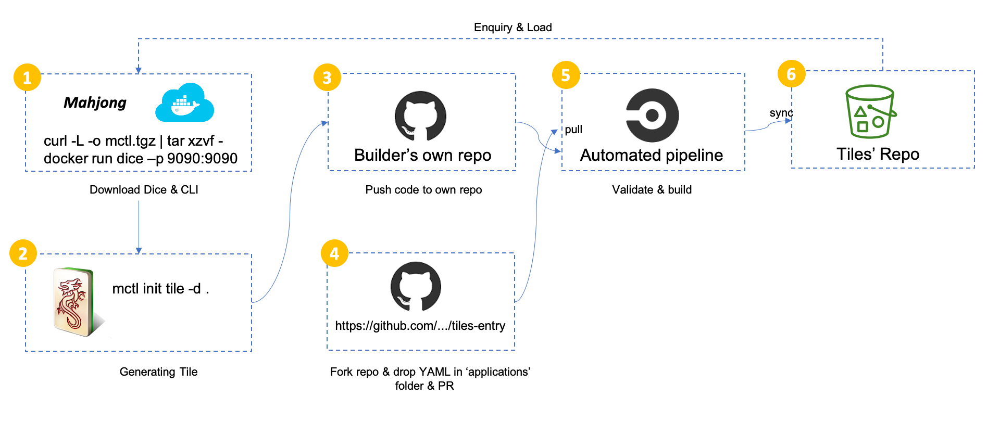

# How to publish your Tile & Hu

## Publish process

## Application for release Tile & Hu

1. Fork https://github.com/awslabs/aws-solutions-assembler

2. Drop your entry file to ['applications'](https://github.com/awslabs/aws-solutions-assembler/repo/applications) folder. The name of entry file should follow convention : !!! GitHub_USER.yaml !!!

3. Fire a PR for further process. 

4. It'll be published to Tile & Hu' repository automatically once get merged and pass through release pipeline.

## Examples

Check out following handy solutions from Hu, or build your own with Tiles.

### Hu

|        Hu    | Repository | Description      |
|-----------------|---------|------------------|
| Simple EKS| https://github.com/mahjong-contributions/eks-simple| Quick launch with few lines of yaml.|
| EKS with Spot instance| https://github.com/mahjong-contributions/eks-spot-simple| Quick launch EKS cluster with mixed spot and on-demand instances, as well as handling spot termination, cluster auto scaler and HPA. |
| EKS Fargate| https://github.com/mahjong-contributions/eks-fargate-simple| Quick launch EKS Fargate with typical configuration. |
| Simple ArgoCD | https://github.com/mahjong-contributions/argocd-simple | Setup ArgoCD on EKS with simple configuration.|
| Basic CD with ArgoCD | https://github.com/mahjong-contributions/argocd-with-app | Building a modern CD with example applicaiton on GitHub, all you need is a GitHub token.|
| Simple Elasticsearch | https://github.com/mahjong-contributions/elasticsearch-simple | Elasticsearch wtih ultra-warm nodes.|
| Perfect Microservice on EKS | https://github.com/mahjong-contributions/09-microservice-all-in-one |  Implement a handy containerized Microsercices architecture on EKS with all major componnets and demo applications. |

### Tiles

|        Tiles    | Repository | Description      |
|-----------------|---------|------------------|
| Basic Network | https://github.com/mahjong-contributions/network0  | The classic network pattern cross multiple availibilty zone with public and private subnets, NAT, etc. |
| Simple EKS| https://github.com/mahjong-contributions/eks0| The basic EKS cluster, which uses EKS 1.15 as default version and depends on Network0. |
| | https://github.com/mahjong-contributions/eks0| Update EKS default version to 1.16 and expose more options. |
| EKS on Spot | https://github.com/mahjong-contributions/eks-with-spot| Provison EKS 1.16 as default and using auto scaling group with mixed spot and normal (4:1) instances. Also has Cluster Autoscaler, Horizontal Pod Autoscaler and Spot Instance Handler setup. |
|EFS | https://github.com/mahjong-contributions/efs|The basic EFS conpoment and based on Network0. EFS is a perfect choice as storage option for Kubernetes. |
|ArgoCD | https://github.com/mahjong-contributions/argocd0|The Argocd0 is basic component to help build up GitOps based CI/CD capability, which depends on Tile - Eks0 & Network0.|
|Go-Bumblebee-ONLY| https://github.com/mahjong-contributions/go-bumblebee-only | This is demo application, which can be deploy to Kubernetes cluster to demostrate rich capabilities.|
|Istio | https://github.com/mahjong-contributions/istio0 | Setup Istio 1.6 on EKS with all necessary features. Managed by Istio operator and Egress Gateway was off by default. |
|AWS KMS | https://github.com/mahjong-contributions/aws-kms-keygenerator | Generate both symmetric key and asymmetric key for down stream applications or services |
|AWS ElastiCache Redis | https://github.com/mahjong-contributions/aws-elasticache-redis | Setup a redis cluster with replcation group with flexiable options. |
|AWS Aurora Mtsql | https://github.com/mahjong-contributions/aws-aurora-mysql | Provision a Aurora MySQL cluster and integrated with Secret Manager to automate secret ratation. |
| Go-BumbleBee-Jazz | https://github.com/mahjong-contributions/go-bumblebee-jazz | Modern cloud native application with tipycal features to try out how great your Kubernetes cluster are.|
| Ambassador | https://github.com/mahjong-contributions/ambassador | Easily expose, secure, and manage traffic to your Kubernetes microservices of any type. Kubernetes API Gateway + Layer 7 Load Balancer + Kubernetes Ingress and more|
| Linkerd | https://github.com/mahjong-contributions/linkerd | Ultralight, security-first service mesh for Kubernetes|
| FluentBit for AWS Elasticsearch | https://github.com/mahjong-contributions/fluentbit-for-aes | Fluent Bit is an open source and multi-platform Log Processor and Forwarder which allows you to collect data/logs from different sources, unify and send them to multiple destinations.|
| MySQL on Kubenetes | https://github.com/mahjong-contributions/mysql-k8s | MyQL 5.6 on Kubernetes |
| Jaeger Tracinng | https://github.com/mahjong-contributions/jaeger-tracing | It's an open source, end-to-end distributed tracing. |
| Traefik | https://github.com/mahjong-contributions/traefik | The Cloud Native Edge Router. |
| Sealed-Secret | https://github.com/mahjong-contributions/sealedsecret-with-existing-eks | Encrypt your Secret into a SealedSecret, which is safe to store - even to a public repository. |
| Amazon Elasticsearch | https://github.com/mahjong-contributions/aws-elasticsearch |  It is a fully managed service that makes it easy for you to deploy, secure, and run Elasticsearch cost effectively at scale. |
